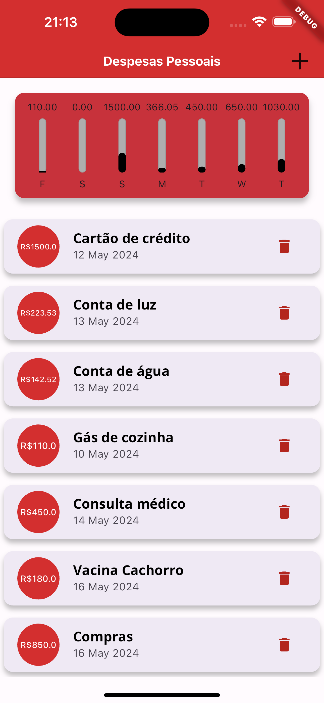

# App_Despesas_Pessoais

Este programa é um programa 100% feito em flutter, que consiste em controlar suas despesas, nele você consegue adicionar despesas, com um titulo, valor, e a data que você fez a transação.
Além disso é mostrado um gráfico com o que foi gasto nos ultimos 7 dias

### O que eu aprendi neste projeto?

Aprendi conceitos iniciais de Flutter, principais widgets, Row, Colunm, chart widget. Criação de formulario, como trabalhar com valores dentro do programa, trabalhando com data e datepicker.
Responsividade, tamanho de tela ideal para o programa ser compatível com qualquer tamanho e tipo de celular. Como deixar o aplicativo em modo paisagem, e widgets adaptativos.

### Layout

  

## Como rodar o projeto?

Com flutter, dart e VSCode instalados e configurados em seu sistema operacional, abra o Prompt de comando (Terminal no macOS) e clone o repositorio utilizando este código<br>
```
git clone https://github.com/ArthurRCastilho/app_despesas.git
```
<br>
Após isso abra a pasta do repositório no seu VSCode.
Selecione qual dispositovo, ou emulador deseja debugar o software.
Abra o arquivo<br>

```
cd {Local que você salvou o diretorio}
```

<br>
E aperte para rodar o seu código, após alguns segundos o programa deve ser aberto para poder testar.

## Como foi feito este projeto?

Este projeto foi totalmente feito a partir de um curso da udemy, na qual você pode [clicar aqui](https://www.udemy.com/course/curso-flutter/?couponCode=ST6MT42324) para acessar o curso<br>

Neste projeto contém estruturas de fundamentos de flutter, sendo elas:
- [x] Criação de componentes com e sem estados;
- [x] Comunicação direta e indiretas;
- [x] Widgets simples de Botão e texto;
- [x] Como colorir determinados textos e botões;
- [x] Centralizar textos;
- [x] Dentre outros fundamentos básicos de flutter.

## Contribua para o respositorio

Entre neste repositorio e crie uma Fork.

Clone o repositorio pelo Prompt de Comando (Terminal no MacOS)
```
git clone https://github.com/[seu_nome]/projetoperguntas.git
```
<br> Abra o repositorio pelo Prompt de Comando

```
cd {caminho/para_o/Repositorio/projetoperguntas}
```

<br> Crie uma nova Branch

```
git checkout -b {nome_da_Branch}
```

<br> Faça todas as alterações/contribuições que deseja

<br> E depois faça o commit de tudo que foi feito

```
git add .
git commit -m '{Alterações feitas}'
```

<br> Envie sua branch para o repositorio forked

```
git fetch upstream
git rebase upstream/main
```

<br>Agora basta enviar sua nova branch para o github

```
git push origin {nome da branch}
```

Por fim no seu github faça uma pull request

<br>

### Tecnologias utilizadas
- ``VSCode``
- ``Dart``
- ``Flutter``
- ``XCode = Emulador de IOs``
- ``Android Studio = Emulador Android``
- ``iPad = Emulador iPadOS``


