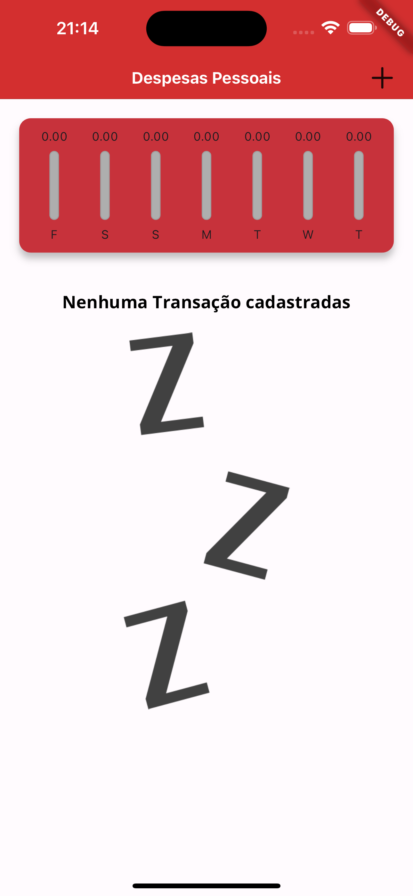
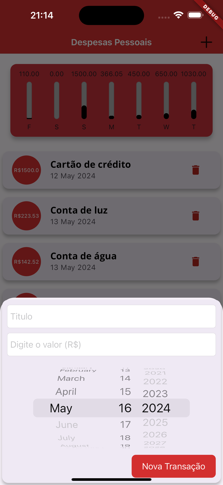

# App_Despesas_Pessoais

Este programa é um programa 100% feito em flutter, que consiste em controlar suas despesas, nele você consegue adicionar despesas, com um titulo, valor, e a data que você fez a transação.
Além disso é mostrado um gráfico com o que foi gasto nos ultimos 7 dias

### O que eu aprendi neste projeto?

Aprendi conceitos iniciais de Flutter, principais widgets, Row, Colunm, chart widget. Criação de formulario, como trabalhar com valores dentro do programa, trabalhando com data e datepicker.
Responsividade, tamanho de tela ideal para o programa ser compatível com qualquer tamanho e tipo de celular. Como deixar o aplicativo em modo paisagem, e widgets adaptativos.

### Layout

  

## Como foi feito este projeto?

Este projeto foi totalmente feito a partir de um curso da udemy, na qual você pode [clicar aqui](https://www.udemy.com/course/curso-flutter/?couponCode=ST6MT42324) para acessar o curso 

Neste projeto contém estruturas de fundamentos de flutter, sendo elas:
- [x] Criação de componentes com e sem estados;
- [x] Comunicação direta e indiretas;
- [x] Widgets simples de Botão e texto;
- [x] Como colorir determinados textos e botões;
- [x] Centralizar textos;
- [x] Dentre outros fundamentos básicos de flutter.

### Tecnologias utilizadas
- ``VSCode``
- ``Dart``
- ``Flutter``
- ``XCode = Emulador de IOs``
- ``Android Studio = Emulador Android``
- ``iPad = Emulador iPadOS``

